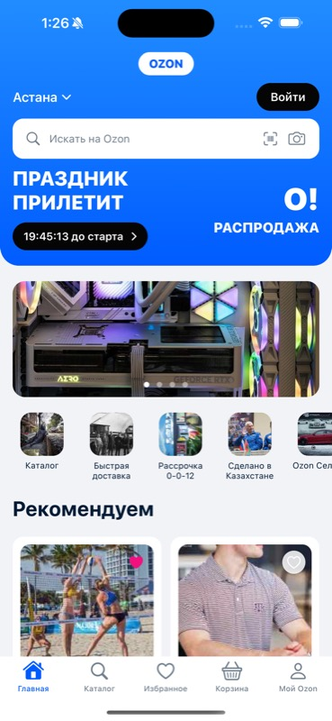
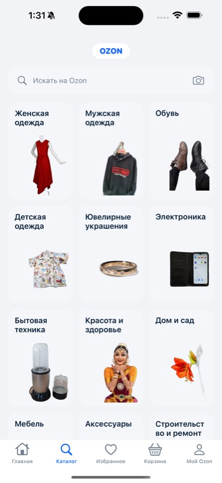
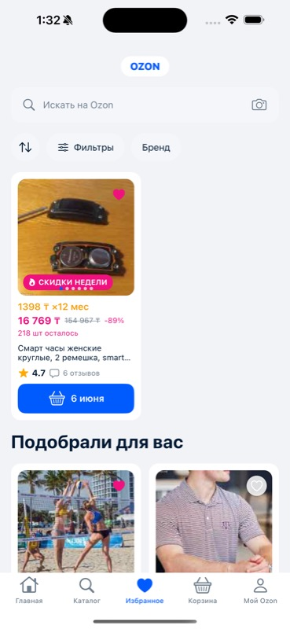
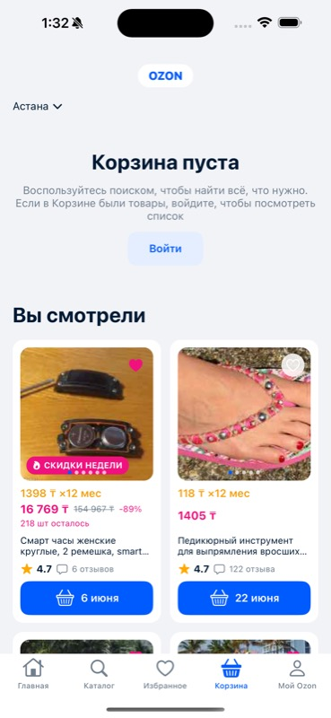
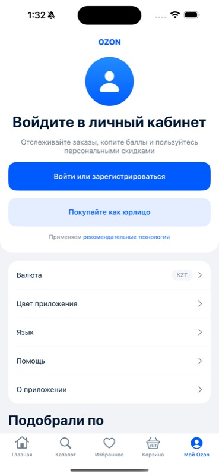

# Ozon-Style iOS (UIKit)

A Russian-language e-commerce storefront built in **UIKit** for iOS 17+, recreating
the OZON marketplace UI from a spec + 5 reference screenshots. Structured with
**MVVM-C** (Model · View · ViewModel · Coordinator): five tabs, one reusable product
card, per-tab navigation controllers, zero dependencies. The UIKit sibling of the
[SwiftUI build](../Ozon-SwiftUI-iOS-Russian-Ecommerce-Market-App) — same screens,
tokens, and data; different framework.

> **Status: implemented + verified.** Builds clean (0 warnings) and runs on the
> iPhone 15 Pro Max simulator; **14/14 UI tests green**.

---

## Screenshots

| Home (Главная) | Catalog (Каталог) | Favorites (Избранное) |
|----------------|-------------------|-----------------------|
|  |  |  |

| Cart (Корзина) | Profile (Мой Ozon) |
|----------------|--------------------|
|  |  |

---

## Tech Stack

| Layer | Technology |
|-------|-----------|
| UI | UIKit (iOS 17), programmatic Auto Layout, no storyboards (except `LaunchScreen`) |
| Architecture | MVVM-C — Model · View · ViewModel · Coordinator |
| Lifecycle | `AppDelegate` (window-based); `AppCoordinator` builds the root |
| Layout | `UIScrollView` + `UIStackView` composition; reusable `UIView` components |
| State / binding | ViewModels + Combine (`@Published` → `sink` for the carousel) |
| Navigation | `UITabBarController` + per-tab `UINavigationController`, driven by coordinators |
| Data | `ProductRepository` protocol → `SampleDataRepository` (DI seam) |
| Images | Asset-catalog imagesets + `ProductImageView` placeholder fallback |
| Project | XcodeGen (`project.yml`) |
| Tests | XCUITest — 14 tests (8 functional + 6 layout), all green |
| Dependencies | None |

---

## Architecture

**MVVM-C.** Each layer has one job and one dependency direction (top → down):

- **Coordinator** — `AppCoordinator` is the composition root: it builds the single
  repository, all five ViewModels, the `UITabBarController`, and five
  `TabCoordinator`s (each wrapping a `UINavigationController`). A `TabCoordinator`
  creates its root VC (injecting the VM + an `onSelectProduct` closure) and pushes
  `ProductDetailViewController` on a product tap. **No view controller pushes
  another view controller.**
- **ViewModel** — one per screen, holds state and screen logic (e.g. the Home
  carousel index + 3s auto-advance, exposed as a Combine `@Published`). Depends only
  on `ProductRepository`; imports no UIKit.
- **View** — `UIViewController`s composing reusable `UIView` components in a scroll
  view. Render VM state, forward intent (product tap) to the coordinator.
- **Model** — domain types behind `ProductRepository`; `SampleDataRepository`
  supplies the in-memory `SampleData` (single source of truth), swappable for a
  network/DB layer without touching any View or ViewModel.

```
┌──────────────────────────────────────────────────────────┐
│  AppDelegate  →  AppCoordinator (composition root)        │
│    ├─ ProductRepository  (SampleDataRepository)           │
│    ├─ 5 ViewModels   (Home · Catalog · Favorites …)       │
│    ├─ UITabBarController                                  │
│    └─ 5 TabCoordinators (one UINavigationController each)  │
└───────────────────────────┬──────────────────────────────┘
                            │ injects VM + onSelectProduct
        ┌───────────────────┴───────────────────────────────┐
        │  ViewControllers (UIScrollView + UIStackView)      │
        │  Home · Catalog · Favorites · Cart · Profile       │
        │       │ tap card → coordinator → push              │
        │       └────────────→ ProductDetailViewController   │
        └───────────────────┬───────────────────────────────┘
        View → VM (Combine)  │ · View → Coordinator (intent)
        ┌───────────────────┴───────────────────────────────┐
        │  ViewModels  (no UIKit)                            │
        │  read via ↓                                        │
        │  ProductRepository  ←  SampleData (single source)  │
        └────────────────────────────────────────────────────┘
              composed of ↑ Components (ProductCardView …)
```

### The keystone rule — one card view, every surface

A single `ProductCardView` renders every product across all screens. Variants change
only the **outer width**, never the internal layout.

```
ProductCardView(product:variant:onTap:)
  variant ─┬─ .grid           → fills a 2-col grid cell   (Home/Favorites/Profile)
           ├─ .viewedGrid      → fills a 2-col grid cell   (Cart "Вы смотрели")
           └─ .featuredCompact → grid-card width, screen left-aligns it
                                                          (Favorites featured)

internal layout (identical for all variants):
  image (1:1, heart · badge · page-dots)
    → PriceBlockView (installment / sale+old+discount / urgency)
    → title (2-line)
    → RatingRowView (★ rating · ru-pluralized review count)
    → CTAButton (basket + delivery date)
```

The whole card is one tappable accessibility element (`productCard`) that fires
`onTap` → the tab coordinator pushes the detail screen.

### Design tokens (single source)

```
DesignSystem/
  UIColor+Tokens.swift  12 semantic colors, asset-catalog backed
                        (extension UIColor { static var brandPrimary … })
  Layout.swift          gutter=16 global · computed grid math
  Typography.swift      10 UIFont styles (UIFontMetrics for Dynamic Type)
  Brand.swift           OZON wordmark + brand colors isolated here
```

---

## Project Structure

```
OzonStyle/
├── App/
│   └── AppDelegate.swift          window lifecycle, starts AppCoordinator
├── Coordinators/
│   ├── Coordinator.swift          protocol
│   ├── AppCoordinator.swift       composition root + UITabBarController
│   ├── TabCoordinator.swift       per-tab UINavigationController + showProduct
│   └── AppRoute.swift             routes (→ ProductDetailViewController)
├── ViewModels/
│   ├── HomeViewModel.swift        banners/quick-actions/recommended + carousel
│   ├── CatalogViewModel · FavoritesViewModel
│   └── CartViewModel · ProfileViewModel
├── Services/
│   └── ProductRepository.swift    protocol + SampleDataRepository (DI seam)
├── DesignSystem/
│   ├── UIColor+Tokens.swift  Layout.swift  Typography.swift  Brand.swift
├── Models/
│   ├── Product.swift  Category.swift  QuickAction.swift  SettingsItem.swift
│   ├── Banner.swift               (all Hashable)
│   └── SampleData.swift           ALL mock content
├── Components/                    reusable UIView subclasses
│   ├── ProductCardView.swift      keystone (+ ProductCardVariant)
│   ├── PriceBlockView · RatingRowView · Buttons (CTA/primary/soft)
│   ├── SearchBarView · ProductImageView · CategoryCardView
│   ├── Chips (Sort + Filter) · QuickActionView · SettingsRowView
│   ├── SectionHeaderView · AppLogoHeaderView · BannerCarouselView
│   ├── GradientViews (gradient/avatar/dark pill) · ProductGrid · UIHelpers
├── Screens/                       one UIViewController per screen
│   ├── ScrollScreenViewController.swift  shared scroll/stack base
│   ├── HomeViewController · CatalogViewController · FavoritesViewController
│   ├── CartViewController · ProfileViewController
│   └── ProductDetailViewController.swift  pushed destination
└── Resources/
    └── Assets.xcassets            12 color sets · AppIcon · imagesets

OzonStyleUITests/
├── OzonStyleUITests.swift         8 functional tests
└── LayoutUITests.swift            6 layout (red-line) tests
```

---

## Setup

### Prerequisites

- Xcode 16+ , iOS 17 simulator
- [XcodeGen](https://github.com/yonaskolb/XcodeGen): `brew install xcodegen`

### Steps

```bash
git clone <repo>
cd Ozon-UIKit-iOS-Russian-Ecommerce-Market-App

xcodegen generate          # regenerates OzonStyle.xcodeproj
open OzonStyle.xcodeproj
```

The project has **no third-party packages** — it builds and runs as-is.

---

## Design fidelity & validation

Verified against the 5 reference screenshots on an iPhone 15 Pro Max simulator.
The gate is visual fidelity + an **MVVM-C layering review** + **8 binary red-lines**
+ the **XCUITest suite** (full report in
[`docs/implementation/validation-report.md`](docs/implementation/validation-report.md)):

| # | Red-line | Status |
|---|----------|--------|
| 1 | Logo pill always below the safe area | ✅ |
| 2 | Favorites featured card compact + left-aligned (never full-width) | ✅ |
| 3 | Cart empty state is a full-width band (not an inset card) | ✅ |
| 4 | Profile = two separate grouped sections | ✅ |
| 5 | Catalog has the centered logo | ✅ |
| 6 | Home hero lives inside the gradient header | ✅ |
| 7 | One shared `Product` model + single `ProductCardView` (no inline tiles) | ✅ |
| 8 | Brand wordmark/colors never hardcoded in screen views | ✅ |

---

## Tests

UI tests (`XCUITest`) cover the full app surface. **14/14 green** on the
iPhone 15 Pro Max simulator — 8 functional + 6 layout.

**Functional** (`OzonStyleUITests.swift`) — structure, content, navigation:
`testTabBarHasFiveTabs`, `testHomeScreen`, `testCatalogScreen`, `testFavoritesScreen`,
`testCartScreen`, `testProfileScreen`, `testProductDetailNavigationFromHome`,
`testProductDetailNavigationFromCart`.

**Layout** (`LayoutUITests.swift`) — the visual red-lines, automated as
`XCUIElement.frame` assertions (no pixel-snapshot library → still zero-dependency):
`testTabBarPinnedToBottom`, `testLogoPillBelowSafeAreaAndCentered`,
`testFavoritesFeaturedIsCompactLeftAligned`, `testCartEmptyBandFullWidth`,
`testHomeGridIsTwoColumn`, `testCatalogGridIsThreeColumn`.

```bash
xcodegen generate
xcodebuild test -scheme OzonStyle \
  -destination 'platform=iOS Simulator,name=iPhone 15 Pro Max'
```

---

## Known constraints (v1 prototype)

- **Mostly inert** — search bars, hearts, chips, CTAs, settings rows, and login
  buttons render fully but do nothing on tap. Interactive paths: tab switching, and
  tapping any product card pushes `ProductDetailViewController` via its tab coordinator.
- **Imagery** — product/quick-action photos are low-res keyword-matched stand-ins;
  category tiles use transparent cutouts; `ProductImageView` falls back to a `photo`
  glyph when an asset is missing. (Asset catalog shared with the SwiftUI build.)
- **Fixed-vs-scaled type** — base fonts target the fixed-size reference but are wrapped
  in `UIFontMetrics`, so labels opting into `adjustsFontForContentSizeCategory` scale.
- **IP** — the OZON wordmark, the О!РАСПРОДАЖА hero lockup, and the third-party
  stand-in photos are isolated in `Brand.swift` + the asset catalog and should be
  swapped before any non-prototype use.

See `docs/implementation/validation-report.md` for documented deviations from the
spec (e.g. scroll+stack instead of compositional layout, `AppDelegate` lifecycle).

---

## Documentation

Spec-first docs that drove the build live in [`docs/`](docs/):
research, requirements, design-system, design, architecture, implementation-plan,
validation-plan, validation-report, and the developer prompt — all for UIKit MVVM-C.
